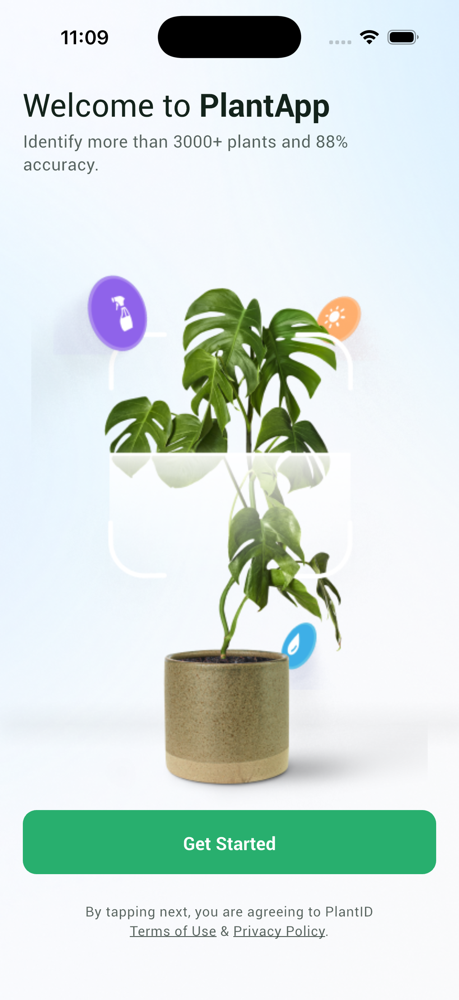
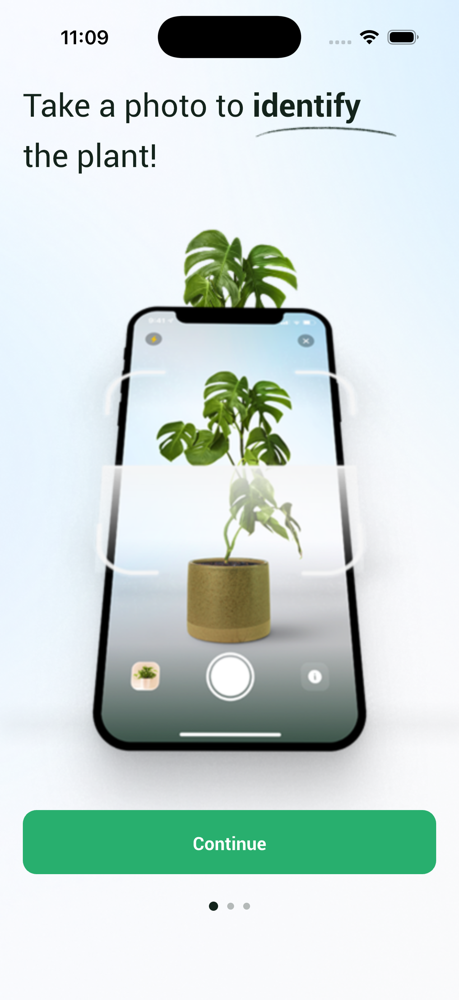
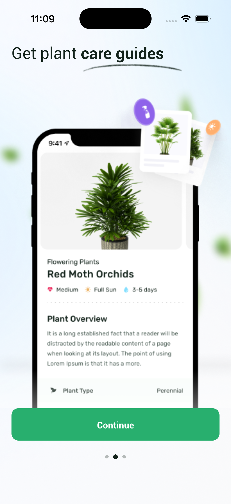
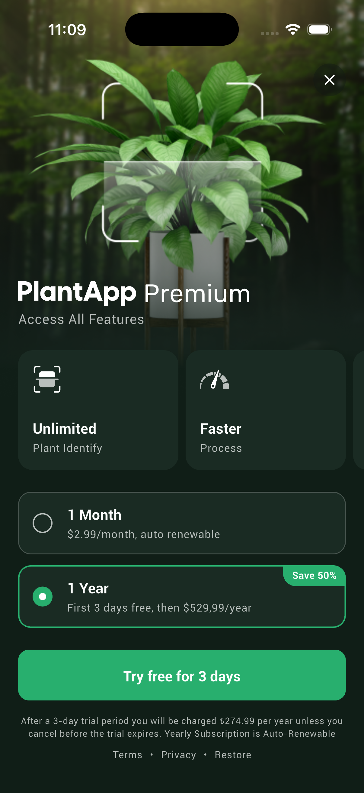
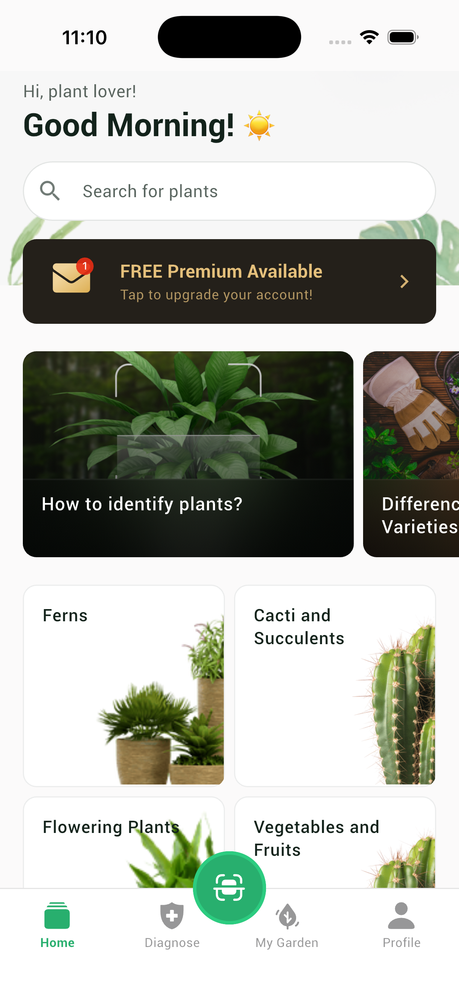

# Plant App

Bitki tanıma ve bakım uygulaması case study projesi. Onboarding → Paywall → Home akışı, API entegrasyonu, yerelleştirme ve tema desteği içerir.

**Repo:** [github.com/metecoban/plant-app](https://github.com/metecoban/plant-app)

## Ekran Görüntüleri

| Get Started | Onboarding 1 | Onboarding 2 |
| --- | --- | --- |
|  |  |  |

| Paywall | Home |
| --- | --- |
|  |  |

## Kullanılan Teknolojiler

| Alan | Paket |
| --- | --- |
| State management | `flutter_bloc` |
| Navigation | `auto_route` |
| DI | `get_it`, `injectable` |
| Network | `dio` |
| Local storage | `shared_preferences` |
| i18n | `slang`, `slang_flutter` |
| Immutability / JSON | `freezed`, `json_serializable` |
| UI | `flutter_svg`, `cached_network_image`, `skeletonizer` |
| Logging | `talker_flutter`, `talker_dio_logger`, `talker_bloc_logger` |
| Code gen | `build_runner`, `auto_route_generator`, `injectable_generator`, `flutter_gen_runner` |
| Test | `flutter_test`, `mocktail` |

## Mimari Yaklaşım

**Feature-first Clean Architecture** kullanıldı. Her feature kendi `data`, `domain` ve `presentation` katmanına sahiptir.

```
Presentation  →  UI, Bloc/Cubit, widgets
Domain        →  Entities, repository contracts, use cases
Data          →  Repository impl, data sources, models
```

**App flow:** Splash sonrası `SharedPreferences` üzerinden onboarding / paywall tamamlanma durumu okunur; `AppFlowCubit` bir sonraki ekranı belirler.

**State management:** Feature karmaşıklığına göre `Cubit` (basit UI state) veya `Bloc` (event-driven, async — örn. Home) tercih edildi.

**Cross-cutting:** `core/` altında network, error handling, storage, i18n ve `BaseView` gibi paylaşılan yapılar yer alır.

## Klasör Yapısı

```
lib/
├── app/                    # MaterialApp, router, theme, DI, app settings
│   ├── di/
│   ├── router/
│   ├── settings/
│   └── theme/
├── core/                   # Paylaşılan altyapı
│   ├── config/
│   ├── error/
│   ├── i18n/
│   ├── logger/
│   ├── network/
│   ├── presentation/       # BaseView
│   └── storage/
├── features/
│   ├── app_flow/           # Splash, onboarding/paywall/home yönlendirme
│   ├── onboarding/
│   ├── paywall/
│   └── home/               # API, HomeBloc, ana ekran UI
├── gen/                    # flutter_gen (assets, fonts)
├── shared/                 # Ortak widget'lar
└── main.dart

assets/
├── fonts/
├── icons/
├── i18n/                   # en.i18n.json, tr.i18n.json
└── images/

test/
├── core/
├── features/               # Unit, bloc/cubit, widget testleri
└── helpers/
```

## Kurulum

**Gereksinimler:** Flutter SDK `^3.12.2`, Dart SDK uyumlu sürüm.

```bash
git clone https://github.com/metecoban/plant-app.git
cd plant-app
flutter pub get
dart run slang
dart run build_runner build --delete-conflicting-outputs
flutter run
```

**API base URL** (varsayılan):

```
https://dummy-api-jtg6bessta-ey.a.run.app
```

Farklı bir ortam için:

```bash
flutter run --dart-define=API_BASE_URL=https://your-api.example
```

## Kod Üretimi

Projede codegen kullanan parçalar:

| Amaç | Komut |
| --- | --- |
| i18n (`slang`) | `dart run slang` |
| Router, DI, freezed, JSON | `dart run build_runner build --delete-conflicting-outputs` |
| Asset type-safe erişim | `build_runner` ile birlikte `flutter_gen_runner` |

Tam yenileme akışı:

```bash
dart run slang
dart run build_runner build --delete-conflicting-outputs
```

## Test Çalıştırma

```bash
flutter test
```

Coverage ile:

```bash
flutter test --coverage
```

Test kapsamı: app flow, onboarding/paywall cubit, home repository & bloc, BaseView, temel widget render senaryoları.

## Analyze

```bash
flutter analyze
```

Commit öncesi önerilen kontrol:

```bash
dart format .
flutter analyze
flutter test
```

## Build Alma

```bash
flutter build apk --release
```

iOS:

```bash
flutter build ios --release
```

## Mimari Kararlar

- **Feature-first Clean Architecture** — feature'lar birbirinden izole; domain katmanı Flutter/UI'dan bağımsız.
- **`BaseView`** — yalnızca `BlocProvider` + `BlocBuilder` / `BlocConsumer` tekrarını azaltır; iş mantığı taşımaz.
- **`BaseCubit` ve gereksiz base class'lar kullanılmadı** — sade ihtiyaç kadar soyutlama.
- **DI: `get_it` + `injectable`** — constructor injection, testlerde mock ile değiştirilebilir.
- **App flow local storage üzerinden yönetildi** — onboarding/paywall tamamlanma bayrakları `SharedPreferences`'ta; tema ve dil tercihleri de yerelde saklanır.
- **Responsive tasarım** — Flutter'ın native layout araçları (`LayoutBuilder`, `MediaQuery`, `Flexible`, grid, padding sabitleri) ile sağlandı; ek responsive paket kullanılmadı.
- **Home için `Bloc` + freezed union state** — loading / success / empty / failure ayrımı tip güvenli `switch` ile yönetilir.
- **Basit ekranlar için `Cubit`** — onboarding sayfa index'i, paywall plan seçimi gibi durumlar.
- **API yanıtları string JSON** — backend bazı endpoint'lerde parse edilmemiş JSON string döndürür; `ResponseParser` ile çözülür.
- **i18n: slang** — type-safe çeviri; çıktı `lib/core/i18n/`.

## Bilinen Sınırlamalar

- Paywall **gerçek satın alma / restore** içermez; UI ve local flow tamamlama simülasyonu vardır.
- Diagnose, My Garden, Scan sekmeleri **placeholder** ekranlardır (başlık + profil ayarları hariç).
- Premium banner, arama ve scan FAB **henüz aksiyona bağlı değildir**.
- `bloc_test` paketi mevcut bağımlılık setiyle (`freezed 4.x` + `flutter_bloc 9`) uyumsuz olduğu için testler `mocktail` + manuel state assertion ile yazıldı.
- Ağ görselleri için `cached_network_image` kullanılır; offline senaryolar sınırlı test edilmiştir.

## Lisans

Case study amaçlıdır; `publish_to: "none"`.
